[Flats](#Flats)

[patches](#Patches)

|**Flat**                         | Normal                              | Specular | Brightmap | Roughness | Metallic | ao |
|---------------------------------|-------------------------------------|----------|-----------|-----------|----------|------------|----|
| | | |  | | | 
Name: **blood1.png** | | | | | |
Also known as: | | | | | |
| | | |  | | | 
Name: **blood2.png** | | | | | |
Also known as: | | | | | |
| | | |  | | | 
Name: **blood3.png** | | | | | |
Also known as: | | | | | |
| | | |  | | | 
Name: **ceil1_1.png** | | | | | |
Also known as: | | | | | |
| | | |  | | | 
Name: **ceil1_2.png** | | | | | |
Also known as: | | | | | |
| | | |  | | | 
Name: **ceil1_3.png** | | | | | |
Also known as: | | | | | |
| | | |  | | | 
Name: **ceil3_1.png** | | | | | |
Also known as: | | | | | |
| | | |  | | | 
Name: **ceil3_2.png** | | | | | |
Also known as: | | | | | |
| | | |  | | | 
Name: **ceil3_3.png** | | | | | |
Also known as: | | | | | |
| | | |  | | | 
Name: **ceil3_4.png** | | | | | |
Also known as: | | | | | |
| | 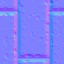| |  | | | 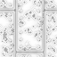
Name: **ceil3_5.png** | | | | | |
Also known as: | | | | | |
| | | |  | | | 
Name: **ceil3_6.png** | | | | | |
Also known as: | | | | | |
| | | |  | | | 
Name: **ceil4_1.png** | | | | | |
Also known as: | | | | | |
| | | |  | | | 
Name: **ceil4_2.png** | | | | | |
Also known as: | | | | | |
| | | |  | | | 
Name: **ceil4_3.png** | | | | | |
Also known as: | | | | | |
| | | |  | | | 
Name: **ceil5_1.png** | | | | | |
Also known as: | | | | | |
| | | |  | | | 
Name: **ceil5_2.png** | | | | | |
Also known as: | | | | | |
| | | |  | | | 
Name: **comp01.png** | | | | | |
Also known as: | | | | | |
| | 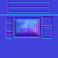| |  | | | 
Name: **cons1_1.png** | | | | | |
Also known as: | | | | | |
| | | |  | | | 
Name: **cons1_5.png** | | | | | |
Also known as: | | | | | |
| | | |  | | | 
Name: **cons1_7.png** | | | | | |
Also known as: | | | | | |
| | | |  | | | 
Name: **cratop1.png** | | | | | |
Also known as: | | | | | |
| | | |  | | | 
Name: **cratop2.png** | | | | | |
Also known as: | | | | | |
| | | |  | | | 
Name: **dem1_1.png** | | | | | |
Also known as: | | | | | |
| | | |  | | | 
Name: **dem1_2.png** | | | | | |
Also known as: | | | | | |
| | | |  | | | 
Name: **dem1_3.png** | | | | | |
Also known as: | | | | | |
| | | |  | | | 
Name: **dem1_4.png** | | | | | |
Also known as: | | | | | |
| | | |  | | | 
Name: **dem1_5.png** | | | | | |
Also known as: | | | | | |
| | | |  | | | 
Name: **dem1_6.png** | | | | | |
Also known as: | | | | | |
| | | |  | | | 
Name: **f_sky1.png** | | | | | |
Also known as: | | | | | |
| | | |  | | | 
Name: **flat1.png** | | | | | |
Also known as: | | | | | |
| | | |  | | | 
Name: **flat10.png** | | | | | |
Also known as: | | | | | |
| | | |  | | | 
Name: **flat14.png** | | | | | |
Also known as: | | | | | |
| | | |  | | | 
Name: **flat17.png** | | | | | |
Also known as: | | | | | |
| | | |  | | | 
Name: **flat18.png** | | | | | |
Also known as: | | | | | |
| | | |  | | | 
Name: **flat19.png** | | | | | |
Also known as: | | | | | |
| | | |  | | | 
Name: **flat1_1.png** | | | | | |
Also known as: | | | | | |
| | | |  | | | 
Name: **flat1_2.png** | | | | | |
Also known as: | | | | | |
| | | |  | | | 
Name: **flat1_3.png** | | | | | |
Also known as: | | | | | |
| | | |  | | | 
Name: **flat2.png** | | | | | |
Also known as: | | | | | |
| | 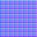| |  | | | 
Name: **flat20.png** | | | | | |
Also known as: | | | | | |
| | | |  | | | 
Name: **flat22.png** | | | | | |
Also known as: | | | | | |
| | | |  | | | 
Name: **flat23.png** | | | | | |
Also known as: | | | | | |
| | | |  | | | 
Name: **flat3.png** | | | | | |
Also known as: | | | | | |
| | | |  | | | 
Name: **flat4.png** | | | | | |
Also known as: | | | | | |
| | 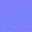| |  | 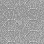| | 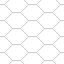
Name: **flat5.png** | | | | | |
Also known as: | | | | | |
| | | |  | | | 
Name: **flat5_1.png** | | | | | |
Also known as: | | | | | |
| | | |  | | | 
Name: **flat5_2.png** | | | | | |
Also known as: | | | | | |
| | | |  | | | 
Name: **flat5_3.png** | | | | | |
Also known as: | | | | | |
| | | |  | | | 
Name: **flat5_4.png** | | | | | |
Also known as: | | | | | |
| | | |  | | | 
Name: **flat5_5.png** | | | | | |
Also known as: | | | | | |
| | | |  | | | 
Name: **flat5_6.png** | | | | | |
Also known as: | | | | | |
| | | |  | | | 
Name: **flat5_7.png** | | | | | |
Also known as: | | | | | |
| | | |  | | | 
Name: **flat5_8.png** | | | | | |
Also known as: | | | | | |
| | | |  | | | 
Name: **flat8.png** | | | | | |
Also known as: | | | | | |
| | | |  | | | 
Name: **flat9.png** | | | | | |
Also known as: | | | | | |
| | | 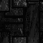|  | | | 
Name: **floor0_1.png** | | | | | |
Also known as: | | | | | |
| | | |  | | | 
Name: **floor0_2.png** | | | | | |
Also known as: | | | | | |
| | | |  | | | 
Name: **floor0_3.png** | | | | | |
Also known as: | | | | | |
| | | |  | | | 
Name: **floor0_5.png** | | | | | |
Also known as: | | | | | |
| | | |  | | | 
Name: **floor0_6.png** | | | | | |
Also known as: | | | | | |
| | | |  | | | 
Name: **floor0_7.png** | | | | | |
Also known as: | | | | | |
| | | |  | | | 
Name: **floor1_1.png** | | | | | |
Also known as: | | | | | |
| | | |  | | | 
Name: **floor1_6.png** | | | | | |
Also known as: | | | | | |
| | | |  | | | 
Name: **floor1_7.png** | | | | | |
Also known as: | | | | | |
| | | |  | | | 
Name: **floor3_3.png** | | | | | |
Also known as: | | | | | |
| | | |  | | | 
Name: **floor4_1.png** | | | | | |
Also known as: | | | | | |
| | | |  | | | 
Name: **floor4_5.png** | | | | | |
Also known as: | | | | | |
| | | |  | | | 
Name: **floor4_6.png** | | | | | |
Also known as: | | | | | |
| | 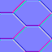| |  | 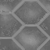| 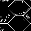| 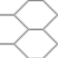
Name: **floor4_8.png** | | | | | |
Also known as: | | | | | |
| | | |  | | 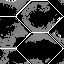| 
Name: **floor5_1.png** | | | | | |
Also known as: | | | | | |
| | 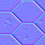| |  | | | 
Name: **floor5_2.png** | | | | | |
Also known as: | | | | | |
| | 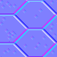| |  | | | 
Name: **floor5_3.png** | | | | | |
Also known as: | | | | | |
| | | |  | | | 
Name: **floor5_4.png** | | | | | |
Also known as: | | | | | |
| | 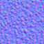| 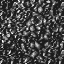|  | | | 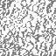
Name: **floor6_1.png** | | | | | |
Also known as: | | | | | |
| | | |  | | | 
Name: **floor6_2.png** | | | | | |
Also known as: | | | | | |
| | | |  | 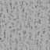| | 
Name: **floor7_1.png** | | | | | |
Also known as: | | | | | |
| | | |  | 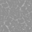| | 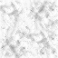
Name: **floor7_2.png** | | | | | |
Also known as: | | | | | |
| | | |  | | | 
Name: **fwater1.png** | | | | | |
Also known as: | | | | | |
| | | |  | | | 
Name: **fwater2.png** | | | | | |
Also known as: | | | | | |
| | | |  | | | 
Name: **fwater3.png** | | | | | |
Also known as: | | | | | |
| | | |  | | | 
Name: **fwater4.png** | | | | | |
Also known as: | | | | | |
| | | |  | | | 
Name: **gate1.png** | | | | | |
Also known as: | | | | | |
| | | |  | | | 
Name: **gate2.png** | | | | | |
Also known as: | | | | | |
| | | |  | | | 
Name: **gate3.png** | | | | | |
Also known as: | | | | | |
| | | |  | | | 
Name: **gate4.png** | | | | | |
Also known as: | | | | | |
| | | |  | | | 
Name: **grass1.png** | | | | | |
Also known as: | | | | | |
| | | |  | | | 
Name: **grass2.png** | | | | | |
Also known as: | | | | | |
| | | |  | | | 
Name: **grnlite1.png** | | | | | |
Also known as: | | | | | |
| | | |  | | | 
Name: **grnrock.png** | | | | | |
Also known as: | | | | | |
| | | |  | | | 
Name: **lava1.png** | | | | | |
Also known as: | | | | | |
| | | |  | | | 
Name: **lava2.png** | | | | | |
Also known as: | | | | | |
| | | |  | | | 
Name: **lava3.png** | | | | | |
Also known as: | | | | | |
| | | |  | | | 
Name: **lava4.png** | | | | | |
Also known as: | | | | | |
| | | 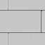|  | | | 
Name: **mflr8_1.png** | | | | | |
Also known as: | | | | | |
| | | |  | | | 
Name: **mflr8_2.png** | | | | | |
Also known as: | | | | | |
| | 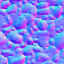| |  | | | 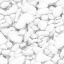
Name: **mflr8_3.png** | | | | | |
Also known as: | | | | | |
| | 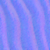| |  | | | 
Name: **mflr8_4.png** | | | | | |
Also known as: | | | | | |
| | | |  | | | 
Name: **nukage1.png** | | | | | |
Also known as: | | | | | |
| | | |  | | | 
Name: **nukage2.png** | | | | | |
Also known as: | | | | | |
| | | |  | | | 
Name: **nukage3.png** | | | | | |
Also known as: | | | | | |
| | | |  | | | 
Name: **rrock01.png** | | | | | |
Also known as: | | | | | |
| | | |  | | | 
Name: **rrock02.png** | | | | | |
Also known as: | | | | | |
| | | |  | | | 
Name: **rrock03.png** | | | | | |
Also known as: | | | | | |
| | | |  | | | 
Name: **rrock04.png** | | | | | |
Also known as: | | | | | |
| | | |  | | | 
Name: **rrock05.png** | | | | | |
Also known as: | | | | | |
| | | |  | | | 
Name: **rrock06.png** | | | | | |
Also known as: | | | | | |
| | | |  | | | 
Name: **rrock07.png** | | | | | |
Also known as: | | | | | |
| | | |  | | | 
Name: **rrock08.png** | | | | | |
Also known as: | | | | | |
| | | |  | | | 
Name: **rrock09.png** | | | | | |
Also known as: | | | | | |
| | | |  | | | 
Name: **rrock10.png** | | | | | |
Also known as: | | | | | |
| | | |  | | | 
Name: **rrock11.png** | | | | | |
Also known as: | | | | | |
| | | |  | | | 
Name: **rrock12.png** | | | | | |
Also known as: | | | | | |
| | | |  | | | 
Name: **rrock13.png** | | | | | |
Also known as: | | | | | |
| | | |  | | | 
Name: **rrock14.png** | | | | | |
Also known as: | | | | | |
| | | |  | | | 
Name: **rrock15.png** | | | | | |
Also known as: | | | | | |
| | | |  | | | 
Name: **rrock16.png** | | | | | |
Also known as: | | | | | |
| | | |  | | | 
Name: **rrock17.png** | | | | | |
Also known as: | | | | | |
| | | |  | | | 
Name: **rrock18.png** | | | | | |
Also known as: | | | | | |
| | | |  | | | 
Name: **rrock19.png** | | | | | |
Also known as: | | | | | |
| | | |  | | | 
Name: **rrock20.png** | | | | | |
Also known as: | | | | | |
| | | |  | | | 
Name: **sflr6_1.png** | | | | | |
Also known as: | | | | | |
| | | |  | | | 
Name: **sflr6_4.png** | | | | | |
Also known as: | | | | | |
| | | |  | | | 
Name: **sflr7_1.png** | | | | | |
Also known as: | | | | | |
| | | |  | | | 
Name: **sflr7_4.png** | | | | | |
Also known as: | | | | | |
| | | |  | | | 
Name: **slime01.png** | | | | | |
Also known as: | | | | | |
| | | |  | | | 
Name: **slime02.png** | | | | | |
Also known as: | | | | | |
| | | |  | | | 
Name: **slime03.png** | | | | | |
Also known as: | | | | | |
| | | |  | | | 
Name: **slime04.png** | | | | | |
Also known as: | | | | | |
| | | |  | | | 
Name: **slime05.png** | | | | | |
Also known as: | | | | | |
| | | |  | | | 
Name: **slime06.png** | | | | | |
Also known as: | | | | | |
| | | |  | | | 
Name: **slime07.png** | | | | | |
Also known as: | | | | | |
| | | |  | | | 
Name: **slime08.png** | | | | | |
Also known as: | | | | | |
| | | |  | | | 
Name: **slime09.png** | | | | | |
Also known as: | | | | | |
| | | |  | | | 
Name: **slime10.png** | | | | | |
Also known as: | | | | | |
| | | |  | | | 
Name: **slime11.png** | | | | | |
Also known as: | | | | | |
| | | |  | | | 
Name: **slime12.png** | | | | | |
Also known as: | | | | | |
| | | |  | | | 
Name: **slime13.png** | | | | | |
Also known as: | | | | | |
| | | |  | | | 
Name: **slime14.png** | | | | | |
Also known as: | | | | | |
| | | |  | | | 
Name: **slime15.png** | | | | | |
Also known as: | | | | | |
| | | |  | | | 
Name: **slime16.png** | | | | | |
Also known as: | | | | | |
| | | |  | | | 
Name: **step1.png** | | | | | |
Also known as: | | | | | |
| | | |  | | | 
Name: **step2.png** | | | | | |
Also known as: | | | | | |
| | | |  | | | 
Name: **tlite6_1.png** | | | | | |
Also known as: | | | | | |
| | | |  | | | 
Name: **tlite6_4.png** | | | | | |
Also known as: | | | | | |
| | | |  | | | 
Name: **tlite6_5.png** | | | | | |
Also known as: | | | | | |
| | | |  | | | 
Name: **tlite6_6.png** | | | | | |
Also known as: | | | | | |

|**Patches**                         | Normal                              | Specular | Brightmap | Roughness | Metallic | ao |
|---------------------------------|-------------------------------------|----------|-----------|-----------|----------|------------|----|
| | | |  | | | 
Name: **ag128_1.png** | | | | | |
Also known as: | | | | | |
| | | |  | | | 
Name: **ag128_2.png** | | | | | |
Also known as: | | | | | |
| | | |  | | | 
Name: **agb128_1.png** | | | | | |
Also known as: | | | | | |
| | | |  | | | 
Name: **altaqua.png** | | | | | |
Also known as: | | | | | |
| | | |  | | | 
Name: **arock2.png** | | | | | |
Also known as: | | | | | |
| | | |  | | | 
Name: **arock3.png** | | | | | |
Also known as: | | | | | |
| | | |  | | | 
Name: **arock4.png** | | | | | |
Also known as: | | | | | |
| | | |  | | | 
Name: **arock5.png** | | | | | |
Also known as: | | | | | |
| | | |  | | | 
Name: **asphalt.png** | | | | | |
Also known as: | | | | | |
| | | |  | | | 
Name: **bcrat16.png** | | | | | |
Also known as: | | | | | |
| | | |  | | | 
Name: **bcrat32.png** | | | | | |
Also known as: | | | | | |
| | | |  | | | 
Name: **bcratel1.png** | | | | | |
Also known as: | | | | | |
| | | |  | | | 
Name: **bcratem1.png** | | | | | |
Also known as: | | | | | |
| | | |  | | | 
Name: **bcrater1.png** | | | | | |
Also known as: | | | | | |
| | | |  | | | 
Name: **bfall1.png** | | | | | |
Also known as: | | | | | |
| | | |  | | | 
Name: **bfall2.png** | | | | | |
Also known as: | | | | | |
| | | |  | | | 
Name: **bfall3.png** | | | | | |
Also known as: | | | | | |
| | | |  | | | 
Name: **bfall4.png** | | | | | |
Also known as: | | | | | |
| | | |  | | | 
Name: **bigmural.png** | | | | | |
Also known as: | | | | | |
| | | |  | | | 
Name: **bigwall.png** | | | | | |
Also known as: | | | | | |
| | | |  | | | 
Name: **blita0.png** | | | | | |
Also known as: | | | | | |
| | | |  | | | 
Name: **blitb0.png** | | | | | |
Also known as: | | | | | |
| | | |  | | | 
Name: **blitc0.png** | | | | | |
Also known as: | | | | | |
| | | |  | | | 
Name: **blod128a.png** | | | | | |
Also known as: | | | | | |
| | | |  | | | 
Name: **blod128b.png** | | | | | |
Also known as: | | | | | |
| | | |  | | | 
Name: **blod64a.png** | | | | | |
Also known as: | | | | | |
| | | |  | | | 
Name: **blod64b.png** | | | | | |
Also known as: | | | | | |
| | | |  | | | 
Name: **blutnt.png** | | | | | |
Also known as: | | | | | |
| | | |  | | | 
Name: **bodies.png** | | | | | |
Also known as: | | | | | |
| | | |  | | | 
Name: **body_1.png** | | | | | |
Also known as: | | | | | |
| | | |  | | | 
Name: **body_2.png** | | | | | |
Also known as: | | | | | |
| | | |  | | | 
Name: **brbrick.png** | | | | | |
Also known as: | | | | | |
| | | |  | | | 
Name: **brbrick2.png** | | | | | |
Also known as: | | | | | |
| | | |  | | | 
Name: **brick.png** | | | | | |
Also known as: | | | | | |
| | | |  | | | 
Name: **brick1.png** | | | | | |
Also known as: | | | | | |
| | | |  | | | 
Name: **brick2.png** | | | | | |
Also known as: | | | | | |
| | | |  | | | 
Name: **brnopen.png** | | | | | |
Also known as: | | | | | |
| | | |  | | | 
Name: **brock2.png** | | | | | |
Also known as: | | | | | |
| | | |  | 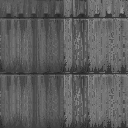| | 
Name: **brown1.png** | | | | | |
Also known as: | | | | | |
| | | |  | | | 
Name: **brown2.png** | | | | | |
Also known as: | | | | | |
| | | |  | | | 
Name: **brown3.png** | | | | | |
Also known as: | | | | | |
| | | |  | | | 
Name: **brown5.png** | | | | | |
Also known as: | | | | | |
| | | |  | | | 
Name: **btntcrat.png** | | | | | |
Also known as: | | | | | |
| | | |  | | | 
Name: **bul64a.png** | | | | | |
Also known as: | | | | | |
| | | |  | | | 
Name: **bul64b.png** | | | | | |
Also known as: | | | | | |
| | | |  | | | 
Name: **bul64c.png** | | | | | |
Also known as: | | | | | |
| | | |  | | | 
Name: **bul64d.png** | | | | | |
Also known as: | | | | | |
| | | |  | | | 
Name: **camo1.png** | | | | | |
Also known as: | | | | | |
| | | |  | | | 
Name: **camo4.png** | | | | | |
Also known as: | | | | | |
| | | |  | | | 
Name: **camo5.png** | | | | | |
Also known as: | | | | | |
| | | |  | | | 
Name: **carllf1.png** | | | | | |
Also known as: | | | | | |
| | | |  | | | 
Name: **carllf2.png** | | | | | |
Also known as: | | | | | |
| | | |  | | | 
Name: **carlrt1.png** | | | | | |
Also known as: | | | | | |
| | | |  | | | 
Name: **carlrt2.png** | | | | | |
Also known as: | | | | | |
| | | |  | | | 
Name: **cavern1.png** | | | | | |
Also known as: | | | | | |
| | | |  | | | 
Name: **cavern4.png** | | | | | |
Also known as: | | | | | |
| | | |  | | | 
Name: **cavern5.png** | | | | | |
Also known as: | | | | | |
| | | |  | | | 
Name: **cavern6.png** | | | | | |
Also known as: | | | | | |
| | | |  | | | 
Name: **cavern7.png** | | | | | |
Also known as: | | | | | |
| | | |  | | | 
Name: **clwdvs3.png** | | | | | |
Also known as: | | | | | |
| | | |  | | | 
Name: **comp01_1.png** | | | | | |
Also known as: | | | | | |
| | | |  | | | 
Name: **comp01_5.png** | | | | | |
Also known as: | | | | | |
| | | |  | | | 
Name: **comp01_6.png** | | | | | |
Also known as: | | | | | |
| | | |  | | | 
Name: **comp02_1.png** | | | | | |
Also known as: | | | | | |
| | | |  | | | 
Name: **comp02_2.png** | | | | | |
Also known as: | | | | | |
| | | |  | | | 
Name: **comp02_3.png** | | | | | |
Also known as: | | | | | |
| | | |  | | | 
Name: **comp02_4.png** | | | | | |
Also known as: | | | | | |
| | | |  | | | 
Name: **comp02_5.png** | | | | | |
Also known as: | | | | | |
| | | |  | | | 
Name: **comp02_6.png** | | | | | |
Also known as: | | | | | |
| | | |  | | | 
Name: **comp02_7.png** | | | | | |
Also known as: | | | | | |
| | | |  | | | 
Name: **comp02_8.png** | | | | | |
Also known as: | | | | | |
| | | |  | | | 
Name: **comp03_1.png** | | | | | |
Also known as: | | | | | |
| | | |  | | | 
Name: **comp03_2.png** | | | | | |
Also known as: | | | | | |
| | | |  | | | 
Name: **comp03_4.png** | | | | | |
Also known as: | | | | | |
| | | |  | | | 
Name: **comp03_5.png** | | | | | |
Also known as: | | | | | |
| | | |  | | | 
Name: **comp03_6.png** | | | | | |
Also known as: | | | | | |
| | | |  | | | 
Name: **comp03_7.png** | | | | | |
Also known as: | | | | | |
| | | |  | | | 
Name: **comp03_8.png** | | | | | |
Also known as: | | | | | |
| | | |  | | | 
Name: **comp03_9.png** | | | | | |
Also known as: | | | | | |
| | | |  | | | 
Name: **comp04_1.png** | | | | | |
Also known as: | | | | | |
| | | |  | | | 
Name: **comp04_2.png** | | | | | |
Also known as: | | | | | |
| | | |  | | | 
Name: **comp04_5.png** | | | | | |
Also known as: | | | | | |
| | | |  | | | 
Name: **comp04_6.png** | | | | | |
Also known as: | | | | | |
| | | |  | | | 
Name: **comp04_7.png** | | | | | |
Also known as: | | | | | |
| | | |  | | | 
Name: **comp04_8.png** | | | | | |
Also known as: | | | | | |
| | | |  | | | 
Name: **comp1b_4.png** | | | | | |
Also known as: | | | | | |
| | | |  | | | 
Name: **comp1c_6.png** | | | | | |
Also known as: | | | | | |
| | | |  | | | 
Name: **concrete.png** | | | | | |
Also known as: | | | | | |
| | | |  | | | 
Name: **crlwdh6.png** | | | | | |
Also known as: | | | | | |
| | | |  | | | 
Name: **crlwdh6b.png** | | | | | |
Also known as: | | | | | |
| | | |  | | | 
Name: **crlwdl12.png** | | | | | |
Also known as: | | | | | |
| | | |  | | | 
Name: **crlwdl6.png** | | | | | |
Also known as: | | | | | |
| | | |  | | | 
Name: **crlwdl6b.png** | | | | | |
Also known as: | | | | | |
| | | |  | | | 
Name: **crlwdl6c.png** | | | | | |
Also known as: | | | | | |
| | | |  | | | 
Name: **crlwdl6d.png** | | | | | |
Also known as: | | | | | |
| | | |  | | | 
Name: **crlwdl6e.png** | | | | | |
Also known as: | | | | | |
| | | |  | | | 
Name: **crlwds6.png** | | | | | |
Also known as: | | | | | |
| | | |  | | | 
Name: **crlwdt3.png** | | | | | |
Also known as: | | | | | |
| | | |  | | | 
Name: **crwdh6.png** | | | | | |
Also known as: | | | | | |
| | | |  | | | 
Name: **crwdh6b.png** | | | | | |
Also known as: | | | | | |
| | | |  | | | 
Name: **crwdl12.png** | | | | | |
Also known as: | | | | | |
| | | |  | | | 
Name: **crwdl6b.png** | | | | | |
Also known as: | | | | | |
| | | |  | | | 
Name: **crwdl6c.png** | | | | | |
Also known as: | | | | | |
| | | |  | | | 
Name: **crwdl6d.png** | | | | | |
Also known as: | | | | | |
| | | |  | | | 
Name: **crwds6.png** | | | | | |
Also known as: | | | | | |
| | | |  | | | 
Name: **crwdt3.png** | | | | | |
Also known as: | | | | | |
| | | |  | | | 
Name: **crwdvs3.png** | | | | | |
Also known as: | | | | | |
| | | |  | | | 
Name: **cyan.png** | | | | | |
Also known as: | | | | | |
| | | |  | | | 
Name: **cyl1_1.png** | | | | | |
Also known as: | | | | | |
| | | |  | | | 
Name: **darkrock.png** | | | | | |
Also known as: | | | | | |
| | | |  | | | 
Name: **dirbri1.png** | | | | | |
Also known as: | | | | | |
| | | |  | | | 
Name: **dirbri2.png** | | | | | |
Also known as: | | | | | |
| | | |  | | | 
Name: **disaster.png** | | | | | |
Also known as: | | | | | |
| | | |  | | | 
Name: **dobigtva.png** | | | | | |
Also known as: | | | | | |
| | | |  | | | 
Name: **dobigtvb.png** | | | | | |
Also known as: | | | | | |
| | | |  | | | 
Name: **dobigtvc.png** | | | | | |
Also known as: | | | | | |
| | | |  | | | 
Name: **dobigtvd.png** | | | | | |
Also known as: | | | | | |
| | | |  | | | 
Name: **doblip1a.png** | | | | | |
Also known as: | | | | | |
| | | |  | | | 
Name: **doblip2a.png** | | | | | |
Also known as: | | | | | |
| | | |  | | | 
Name: **doblip3a.png** | | | | | |
Also known as: | | | | | |
| | | |  | | | 
Name: **doblip4a.png** | | | | | |
Also known as: | | | | | |
| | | |  | | | 
Name: **dobwire.png** | | | | | |
Also known as: | | | | | |
| | | |  | | | 
Name: **dobwire2.png** | | | | | |
Also known as: | | | | | |
| | | |  | | | 
Name: **doeday.png** | | | | | |
Also known as: | | | | | |
| | | |  | | | 
Name: **doehell.png** | | | | | |
Also known as: | | | | | |
| | | |  | | | 
Name: **doenite.png** | | | | | |
Also known as: | | | | | |
| | | |  | | | 
Name: **dogldir.png** | | | | | |
Also known as: | | | | | |
| | | |  | | | 
Name: **doglpanl.png** | | | | | |
Also known as: | | | | | |
| | | |  | | | 
Name: **dogrid.png** | | | | | |
Also known as: | | | | | |
| | | |  | | | 
Name: **dogrmsc.png** | | | | | |
Also known as: | | | | | |
| | | |  | | | 
Name: **dogrnmen.png** | | | | | |
Also known as: | | | | | |
| | | |  | | | 
Name: **dokgrir.png** | | | | | |
Also known as: | | | | | |
| | | |  | | | 
Name: **dokodo1b.png** | | | | | |
Also known as: | | | | | |
| | | |  | | | 
Name: **dokodo2b.png** | | | | | |
Also known as: | | | | | |
| | | |  | | | 
Name: **donday.png** | | | | | |
Also known as: | | | | | |
| | | |  | | | 
Name: **donhell.png** | | | | | |
Also known as: | | | | | |
| | | |  | | | 
Name: **donnite.png** | | | | | |
Also known as: | | | | | |
| | | |  | | | 
Name: **door11_1.png** | | | | | |
Also known as: | | | | | |
| | | |  | | | 
Name: **door12_1.png** | | | | | |
Also known as: | | | | | |
| | | |  | | | 
Name: **door15_1.png** | | | | | |
Also known as: | | | | | |
| | | |  | | | 
Name: **door15_2.png** | | | | | |
Also known as: | | | | | |
| | | |  | | | 
Name: **door15_3.png** | | | | | |
Also known as: | | | | | |
| | | |  | | | 
Name: **door15_4.png** | | | | | |
Also known as: | | | | | |
| | 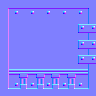| |  | 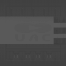| 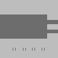| 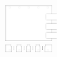
Name: **door2_1.png** | | | | | |
Also known as: | | | | | |
| | | |  | | | 
Name: **door2_3.png** | | | | | |
Also known as: | | | | | |
| | | |  | | | 
Name: **door2_4.png** | | | | | |
Also known as: | | | | | |
| | | |  | | | 
Name: **door2_5.png** | | | | | |
Also known as: | | | | | |
| | | |  | | | 
Name: **door3_4.png** | | | | | |
Also known as: | | | | | |
| | | |  | | | 
Name: **door3_5.png** | | | | | |
Also known as: | | | | | |
| | | |  | | | 
Name: **door3_6.png** | | | | | |
Also known as: | | | | | |
| | | |  | | | 
Name: **door9_1.png** | | | | | |
Also known as: | | | | | |
| | | |  | | | 
Name: **door9_2.png** | | | | | |
Also known as: | | | | | |
| | | |  | | | 
Name: **doortrak.png** | | | | | |
Also known as: | | | | | |
| | | |  | | | 
Name: **dopunk4.png** | | | | | |
Also known as: | | | | | |
| | | |  | | | 
Name: **dored.png** | | | | | |
Also known as: | | | | | |
| | | |  | | | 
Name: **dosday.png** | | | | | |
Also known as: | | | | | |
| | | |  | | | 
Name: **dosha1.png** | | | | | |
Also known as: | | | | | |
| | | |  | | | 
Name: **doshb1.png** | | | | | |
Also known as: | | | | | |
| | | |  | | | 
Name: **doshc1.png** | | | | | |
Also known as: | | | | | |
| | | |  | | | 
Name: **doshd1.png** | | | | | |
Also known as: | | | | | |
| | | |  | | | 
Name: **doshe1.png** | | | | | |
Also known as: | | | | | |
| | | |  | | | 
Name: **doshell.png** | | | | | |
Also known as: | | | | | |
| | | |  | | | 
Name: **doshf1.png** | | | | | |
Also known as: | | | | | |
| | | |  | | | 
Name: **doslvr11.png** | | | | | |
Also known as: | | | | | |
| | | |  | | | 
Name: **doslvr12.png** | | | | | |
Also known as: | | | | | |
| | | |  | | | 
Name: **doslvr13.png** | | | | | |
Also known as: | | | | | |
| | | |  | | | 
Name: **doslvr14.png** | | | | | |
Also known as: | | | | | |
| | | |  | | | 
Name: **doslvr21.png** | | | | | |
Also known as: | | | | | |
| | | |  | | | 
Name: **doslvr22.png** | | | | | |
Also known as: | | | | | |
| | | |  | | | 
Name: **doslvr23.png** | | | | | |
Also known as: | | | | | |
| | | |  | | | 
Name: **doslvr24.png** | | | | | |
Also known as: | | | | | |
| | | |  | | | 
Name: **dosnite.png** | | | | | |
Also known as: | | | | | |
| | | |  | | | 
Name: **dospi1b.png** | | | | | |
Also known as: | | | | | |
| | | |  | | | 
Name: **dospi2b.png** | | | | | |
Also known as: | | | | | |
| | | |  | | | 
Name: **dospi3b.png** | | | | | |
Also known as: | | | | | |
| | | |  | | | 
Name: **dospi4b.png** | | | | | |
Also known as: | | | | | |
| | | |  | | | 
Name: **dosw1.png** | | | | | |
Also known as: | | | | | |
| | | |  | | | 
Name: **dosw1c.png** | | | | | |
Also known as: | | | | | |
| | | |  | | | 
Name: **dosw2.png** | | | | | |
Also known as: | | | | | |
| | | |  | | | 
Name: **dosw2c.png** | | | | | |
Also known as: | | | | | |
| | | |  | | | 
Name: **dosw3.png** | | | | | |
Also known as: | | | | | |
| | | |  | | | 
Name: **dosw3c.png** | | | | | |
Also known as: | | | | | |
| | | |  | | | 
Name: **dosw4.png** | | | | | |
Also known as: | | | | | |
| | | |  | | | 
Name: **dosw4c.png** | | | | | |
Also known as: | | | | | |
| | | |  | | | 
Name: **doswx1.png** | | | | | |
Also known as: | | | | | |
| | | |  | | | 
Name: **doswx1c.png** | | | | | |
Also known as: | | | | | |
| | | |  | | | 
Name: **doswx2.png** | | | | | |
Also known as: | | | | | |
| | | |  | | | 
Name: **doswx2c.png** | | | | | |
Also known as: | | | | | |
| | | |  | | | 
Name: **doswx3.png** | | | | | |
Also known as: | | | | | |
| | | |  | | | 
Name: **doswx3c.png** | | | | | |
Also known as: | | | | | |
| | | |  | | | 
Name: **doswx4.png** | | | | | |
Also known as: | | | | | |
| | | |  | | | 
Name: **doswx4c.png** | | | | | |
Also known as: | | | | | |
| | | |  | | | 
Name: **dotntdr.png** | | | | | |
Also known as: | | | | | |
| | | |  | | | 
Name: **dotv1b.png** | | | | | |
Also known as: | | | | | |
| | | |  | | | 
Name: **dotv2b.png** | | | | | |
Also known as: | | | | | |
| | | |  | | | 
Name: **dotv3b.png** | | | | | |
Also known as: | | | | | |
| | | |  | | | 
Name: **dotv4b.png** | | | | | |
Also known as: | | | | | |
| | | |  | | | 
Name: **dowday.png** | | | | | |
Also known as: | | | | | |
| | | |  | | | 
Name: **dowebl.png** | | | | | |
Also known as: | | | | | |
| | | |  | | | 
Name: **dowebr.png** | | | | | |
Also known as: | | | | | |
| | | |  | | | 
Name: **dowhell.png** | | | | | |
Also known as: | | | | | |
| | | |  | | | 
Name: **dowindow.png** | | | | | |
Also known as: | | | | | |
| | | |  | | | 
Name: **downite.png** | | | | | |
Also known as: | | | | | |
| | | |  | | | 
Name: **drfront.png** | | | | | |
Also known as: | | | | | |
| | | |  | | | 
Name: **drside1.png** | | | | | |
Also known as: | | | | | |
| | | |  | | | 
Name: **drside2.png** | | | | | |
Also known as: | | | | | |
| | | |  | | | 
Name: **drtopfr.png** | | | | | |
Also known as: | | | | | |
| | | |  | | | 
Name: **drtopsid.png** | | | | | |
Also known as: | | | | | |
| | | |  | | | 
Name: **duct1.png** | | | | | |
Also known as: | | | | | |
| | | |  | | | 
Name: **eggreeni.png** | | | | | |
Also known as: | | | | | |
| | | |  | | | 
Name: **egredi.png** | | | | | |
Also known as: | | | | | |
| | | |  | | | 
Name: **exit1.png** | | | | | |
Also known as: | | | | | |
| | | |  | | | 
Name: **exit2.png** | | | | | |
Also known as: | | | | | |
| | | |  | | | 
Name: **fence4.png** | | | | | |
Also known as: | | | | | |
| | | |  | | | 
Name: **fence5.png** | | | | | |
Also known as: | | | | | |
| | | |  | | | 
Name: **fireblu1.png** | | | | | |
Also known as: | | | | | |
| | | |  | | | 
Name: **fireblu2.png** | | | | | |
Also known as: | | | | | |
| | | |  | | | 
Name: **flamp.png** | | | | | |
Also known as: | | | | | |
| | | |  | | | 
Name: **gcratel1.png** | | | | | |
Also known as: | | | | | |
| | | |  | | | 
Name: **gcratem1.png** | | | | | |
Also known as: | | | | | |
| | | |  | | | 
Name: **gcrater1.png** | | | | | |
Also known as: | | | | | |
| | | |  | | | 
Name: **grate.png** | | | | | |
Also known as: | | | | | |
| | | |  | | | 
Name: **grnlit1.png** | | | | | |
Also known as: | | | | | |
| | | |  | | | 
Name: **grnopen.png** | | | | | |
Also known as: | | | | | |
| | | |  | | | 
Name: **hell5_1.png** | | | | | |
Also known as: | | | | | |
| | | |  | | | 
Name: **hell5_2.png** | | | | | |
Also known as: | | | | | |
| | | |  | | | 
Name: **hell6_1.png** | | | | | |
Also known as: | | | | | |
| | | |  | | | 
Name: **hell6_2.png** | | | | | |
Also known as: | | | | | |
| | | |  | | | 
Name: **hell6_3.png** | | | | | |
Also known as: | | | | | |
| | | |  | | | 
Name: **hell8_1.png** | | | | | |
Also known as: | | | | | |
| | | |  | | | 
Name: **hell8_2.png** | | | | | |
Also known as: | | | | | |
| | | |  | | | 
Name: **hell8_3.png** | | | | | |
Also known as: | | | | | |
| | | |  | | | 
Name: **hell8_4.png** | | | | | |
Also known as: | | | | | |
| | | |  | | | 
Name: **ladder16.png** | | | | | |
Also known as: | | | | | |
| | | |  | | | 
Name: **longwall.png** | | | | | |
Also known as: | | | | | |
| | | |  | | | 
Name: **m1_1.png** | | | | | |
Also known as: | | | | | |
| | | |  | | | 
Name: **marble1.png** | | | | | |
Also known as: | | | | | |
| | | |  | | | 
Name: **mc1.png** | | | | | |
Also known as: | | | | | |
| | | |  | | | 
Name: **mc10.png** | | | | | |
Also known as: | | | | | |
| | | |  | | | 
Name: **mc11.png** | | | | | |
Also known as: | | | | | |
| | | |  | | | 
Name: **mc12.png** | | | | | |
Also known as: | | | | | |
| | | |  | | | 
Name: **mc13.png** | | | | | |
Also known as: | | | | | |
| | | |  | | | 
Name: **mc14.png** | | | | | |
Also known as: | | | | | |
| | | |  | | | 
Name: **mc15.png** | | | | | |
Also known as: | | | | | |
| | | |  | | | 
Name: **mc16.png** | | | | | |
Also known as: | | | | | |
| | | |  | | | 
Name: **mc17.png** | | | | | |
Also known as: | | | | | |
| | | |  | | | 
Name: **mc18.png** | | | | | |
Also known as: | | | | | |
| | | |  | | | 
Name: **mc19.png** | | | | | |
Also known as: | | | | | |
| | | |  | | | 
Name: **mc2.png** | | | | | |
Also known as: | | | | | |
| | | |  | | | 
Name: **mc20.png** | | | | | |
Also known as: | | | | | |
| | | |  | | | 
Name: **mc3.png** | | | | | |
Also known as: | | | | | |
| | | |  | | | 
Name: **mc4.png** | | | | | |
Also known as: | | | | | |
| | | |  | | | 
Name: **mc5.png** | | | | | |
Also known as: | | | | | |
| | | |  | | | 
Name: **mc6.png** | | | | | |
Also known as: | | | | | |
| | | |  | | | 
Name: **mc7.png** | | | | | |
Also known as: | | | | | |
| | | |  | | | 
Name: **mc8.png** | | | | | |
Also known as: | | | | | |
| | | |  | | | 
Name: **ml_sky1.png** | | | | | |
Also known as: | | | | | |
| | | |  | | | 
Name: **ml_sky2.png** | | | | | |
Also known as: | | | | | |
| | | |  | | | 
Name: **ml_sky3.png** | | | | | |
Also known as: | | | | | |
| | | |  | | | 
Name: **mosrok2.png** | | | | | |
Also known as: | | | | | |
| | | |  | | | 
Name: **mossbrik.png** | | | | | |
Also known as: | | | | | |
| | | |  | | | 
Name: **mossrock.png** | | | | | |
Also known as: | | | | | |
| | | |  | | | 
Name: **mould.png** | | | | | |
Also known as: | | | | | |
| | | |  | | | 
Name: **mtnt2.png** | | | | | |
Also known as: | | | | | |
| | | |  | | | 
Name: **mud.png** | | | | | |
Also known as: | | | | | |
| | | |  | | | 
Name: **mural1.png** | | | | | |
Also known as: | | | | | |
| | | |  | | | 
Name: **mural2.png** | | | | | |
Also known as: | | | | | |
| | | |  | | | 
Name: **mwall1_1.png** | | | | | |
Also known as: | | | | | |
| | | |  | | | 
Name: **mwall1_2.png** | | | | | |
Also known as: | | | | | |
| | | |  | | | 
Name: **mwall2_1.png** | | | | | |
Also known as: | | | | | |
| | | |  | | | 
Name: **mwall3_1.png** | | | | | |
Also known as: | | | | | |
| | | |  | | | 
Name: **mwall4_1.png** | | | | | |
Also known as: | | | | | |
| | | |  | | | 
Name: **mwall4_2.png** | | | | | |
Also known as: | | | | | |
| | | |  | | | 
Name: **mwall5_1.png** | | | | | |
Also known as: | | | | | |
| | | |  | | | 
Name: **mywood.png** | | | | | |
Also known as: | | | | | |
| | | |  | | | 
Name: **natrock.png** | | | | | |
Also known as: | | | | | |
| | | |  | | | 
Name: **nukedge.png** | | | | | |
Also known as: | | | | | |
| | | |  | | | 
Name: **pblak.png** | | | | | |
Also known as: | | | | | |
| | | |  | | | 
Name: **pcwinl.png** | | | | | |
Also known as: | | | | | |
| | | |  | | | 
Name: **pillar.png** | | | | | |
Also known as: | | | | | |
| | | |  | | | 
Name: **pivy3.png** | | | | | |
Also known as: | | | | | |
| | | |  | | | 
Name: **pl_01.png** | | | | | |
Also known as: | | | | | |
| | | |  | | | 
Name: **pl_05.png** | | | | | |
Also known as: | | | | | |
| | | |  | | | 
Name: **pl_10.png** | | | | | |
Also known as: | | | | | |
| | | |  | | | 
Name: **pl_18.png** | | | | | |
Also known as: | | | | | |
| | | |  | | | 
Name: **pl_19.png** | | | | | |
Also known as: | | | | | |
| | | |  | | | 
Name: **pl_20.png** | | | | | |
Also known as: | | | | | |
| | | |  | | | 
Name: **pl_25.png** | | | | | |
Also known as: | | | | | |
| | | |  | | | 
Name: **pl_31.png** | | | | | |
Also known as: | | | | | |
| | | |  | | | 
Name: **pl_a.png** | | | | | |
Also known as: | | | | | |
| | | |  | | | 
Name: **pl_c.png** | | | | | |
Also known as: | | | | | |
| | | |  | | | 
Name: **pl_n.png** | | | | | |
Also known as: | | | | | |
| | | |  | | | 
Name: **pl_t.png** | | | | | |
Also known as: | | | | | |
| | | |  | | | 
Name: **pl_u.png** | | | | | |
Also known as: | | | | | |
| | | |  | | | 
Name: **plat2_1.png** | | | | | |
Also known as: | | | | | |
| | | |  | | | 
Name: **poison.png** | | | | | |
Also known as: | | | | | |
| | | |  | | | 
Name: **preel1.png** | | | | | |
Also known as: | | | | | |
| | | |  | | | 
Name: **preel2.png** | | | | | |
Also known as: | | | | | |
| | | |  | | | 
Name: **preel3.png** | | | | | |
Also known as: | | | | | |
| | | |  | | | 
Name: **preel4.png** | | | | | |
Also known as: | | | | | |
| | | |  | | | 
Name: **preel5.png** | | | | | |
Also known as: | | | | | |
| | | |  | | | 
Name: **preel6.png** | | | | | |
Also known as: | | | | | |
| | | |  | | | 
Name: **preel7.png** | | | | | |
Also known as: | | | | | |
| | | |  | | | 
Name: **ps15a0.png** | | | | | |
Also known as: | | | | | |
| | | |  | | | 
Name: **ps18a0.png** | | | | | |
Also known as: | | | | | |
| | | |  | | | 
Name: **ps20a0.png** | | | | | |
Also known as: | | | | | |
| | | |  | | | 
Name: **psky1.png** | | | | | |
Also known as: | | | | | |
| | | |  | | | 
Name: **psky2a.png** | | | | | |
Also known as: | | | | | |
| | | |  | | | 
Name: **psky2b.png** | | | | | |
Also known as: | | | | | |
| | | |  | | | 
Name: **psky2c.png** | | | | | |
Also known as: | | | | | |
| | | |  | | | 
Name: **psky2d.png** | | | | | |
Also known as: | | | | | |
| | | |  | | | 
Name: **psky3a.png** | | | | | |
Also known as: | | | | | |
| | | |  | | | 
Name: **psky3b.png** | | | | | |
Also known as: | | | | | |
| | | |  | | | 
Name: **pston2.png** | | | | | |
Also known as: | | | | | |
| | | |  | | | 
Name: **pwfall1.png** | | | | | |
Also known as: | | | | | |
| | | |  | | | 
Name: **pwfall2.png** | | | | | |
Also known as: | | | | | |
| | | |  | | | 
Name: **pwfall3.png** | | | | | |
Also known as: | | | | | |
| | | |  | | | 
Name: **pwfall4.png** | | | | | |
Also known as: | | | | | |
| | | |  | | | 
Name: **railing.png** | | | | | |
Also known as: | | | | | |
| | | |  | | | 
Name: **redlite1.png** | | | | | |
Also known as: | | | | | |
| | | |  | | | 
Name: **redlite2.png** | | | | | |
Also known as: | | | | | |
| | | |  | | | 
Name: **redopen.png** | | | | | |
Also known as: | | | | | |
| | | |  | | | 
Name: **redrock.png** | | | | | |
Also known as: | | | | | |
| | | |  | | | 
Name: **redtnt2.png** | | | | | |
Also known as: | | | | | |
| | | |  | | | 
Name: **ripw15.png** | | | | | |
Also known as: | | | | | |
| | | |  | | | 
Name: **rock.png** | | | | | |
Also known as: | | | | | |
| | | |  | | | 
Name: **romero1.png** | | | | | |
Also known as: | | | | | |
| | | |  | | | 
Name: **rp1_1.png** | | | | | |
Also known as: | | | | | |
| | | |  | | | 
Name: **rp1_2.png** | | | | | |
Also known as: | | | | | |
| | | |  | | | 
Name: **rp2_1.png** | | | | | |
Also known as: | | | | | |
| | | |  | | | 
Name: **rp2_2.png** | | | | | |
Also known as: | | | | | |
| | | |  | | | 
Name: **rp2_3.png** | | | | | |
Also known as: | | | | | |
| | | |  | | | 
Name: **rp2_4.png** | | | | | |
Also known as: | | | | | |
| | | |  | | | 
Name: **rsky1.png** | | | | | |
Also known as: | | | | | |
| | | |  | | | 
Name: **rsky2.png** | | | | | |
Also known as: | | | | | |
| | | |  | | | 
Name: **rsky3.png** | | | | | |
Also known as: | | | | | |
| | | |  | | | 
Name: **rw10_1.png** | | | | | |
Also known as: | | | | | |
| | | |  | | | 
Name: **rw10_2.png** | | | | | |
Also known as: | | | | | |
| | | |  | | | 
Name: **rw10_3.png** | | | | | |
Also known as: | | | | | |
| | | |  | | | 
Name: **rw10_4.png** | | | | | |
Also known as: | | | | | |
| | | |  | | | 
Name: **rw11_2.png** | | | | | |
Also known as: | | | | | |
| | | |  | | | 
Name: **rw11_3.png** | | | | | |
Also known as: | | | | | |
| | | |  | | | 
Name: **rw12_1.png** | | | | | |
Also known as: | | | | | |
| | | |  | | | 
Name: **rw12_2.png** | | | | | |
Also known as: | | | | | |
| | | |  | | | 
Name: **rw12_3.png** | | | | | |
Also known as: | | | | | |
| | | |  | | | 
Name: **rw12_4.png** | | | | | |
Also known as: | | | | | |
| | | |  | | | 
Name: **rw13_1.png** | | | | | |
Also known as: | | | | | |
| | | |  | | | 
Name: **rw14_1.png** | | | | | |
Also known as: | | | | | |
| | | |  | | | 
Name: **rw15_1.png** | | | | | |
Also known as: | | | | | |
| | | |  | | | 
Name: **rw15_2.png** | | | | | |
Also known as: | | | | | |
| | | |  | | | 
Name: **rw15_3.png** | | | | | |
Also known as: | | | | | |
| | | |  | | | 
Name: **rw15_4.png** | | | | | |
Also known as: | | | | | |
| | | |  | | | 
Name: **rw16_1.png** | | | | | |
Also known as: | | | | | |
| | | |  | | | 
Name: **rw16_2.png** | | | | | |
Also known as: | | | | | |
| | | |  | | | 
Name: **rw16_3.png** | | | | | |
Also known as: | | | | | |
| | | |  | | | 
Name: **rw16_4.png** | | | | | |
Also known as: | | | | | |
| | | |  | | | 
Name: **rw18_1.png** | | | | | |
Also known as: | | | | | |
| | | |  | | | 
Name: **rw18_2.png** | | | | | |
Also known as: | | | | | |
| | | |  | | | 
Name: **rw18_3.png** | | | | | |
Also known as: | | | | | |
| | | |  | | | 
Name: **rw18_4.png** | | | | | |
Also known as: | | | | | |
| | | |  | | | 
Name: **rw19_1.png** | | | | | |
Also known as: | | | | | |
| | | |  | | | 
Name: **rw19_2.png** | | | | | |
Also known as: | | | | | |
| | | |  | | | 
Name: **rw19_3.png** | | | | | |
Also known as: | | | | | |
| | | |  | | | 
Name: **rw19_4.png** | | | | | |
Also known as: | | | | | |
| | | |  | | | 
Name: **rw1_1.png** | | | | | |
Also known as: | | | | | |
| | | |  | | | 
Name: **rw1_2.png** | | | | | |
Also known as: | | | | | |
| | | |  | | | 
Name: **rw1_3.png** | | | | | |
Also known as: | | | | | |
| | | |  | | | 
Name: **rw1_4.png** | | | | | |
Also known as: | | | | | |
| | | |  | | | 
Name: **rw20_1.png** | | | | | |
Also known as: | | | | | |
| | | |  | | | 
Name: **rw20_2.png** | | | | | |
Also known as: | | | | | |
| | | |  | | | 
Name: **rw20_3.png** | | | | | |
Also known as: | | | | | |
| | | |  | | | 
Name: **rw20_4.png** | | | | | |
Also known as: | | | | | |
| | | |  | | | 
Name: **rw21_1.png** | | | | | |
Also known as: | | | | | |
| | | |  | | | 
Name: **rw21_2.png** | | | | | |
Also known as: | | | | | |
**panbord2**| | |  | | | 
| | | |  | | | 
Name: **rw21_3.png** | | | | | |
Also known as: | | | | | |
| | | |  | | | 
Name: **rw21_4.png** | | | | | |
Also known as: | | | | | |
| | | |  | | | 
Name: **rw21_5.png** | | | | | |
Also known as: | | | | | |
| | | |  | | | 
Name: **rw22_1.png** | | | | | |
Also known as: | | | | | |
| | | |  | | | 
Name: **rw22_2.png** | | | | | |
Also known as: | | | | | |
| | | |  | | | 
Name: **rw22_3.png** | | | | | |
Also known as: | | | | | |
| | | |  | | | 
Name: **rw23_1.png** | | | | | |
Also known as: | | | | | |
| | | |  | | | 
Name: **rw23_2.png** | | | | | |
Also known as: | | | | | |
| | | |  | | | 
Name: **rw23_3.png** | | | | | |
Also known as: | | | | | |
| | | |  | | | 
Name: **rw23_4.png** | | | | | |
Also known as: | | | | | |
| | | |  | | | 
Name: **rw24_1.png** | | | | | |
Also known as: | | | | | |
| | | |  | | | 
Name: **rw24_2.png** | | | | | |
Also known as: | | | | | |
| | | |  | | | 
Name: **rw24_3.png** | | | | | |
Also known as: | | | | | |
| | | |  | | | 
Name: **rw24_4.png** | | | | | |
Also known as: | | | | | |
| | | |  | | | 
Name: **rw25_1.png** | | | | | |
Also known as: | | | | | |
| | | |  | | | 
Name: **rw25_2.png** | | | | | |
Also known as: | | | | | |
| | | |  | | | 
Name: **rw25_3.png** | | | | | |
Also known as: | | | | | |
| | | |  | | | 
Name: **rw25_4.png** | | | | | |
Also known as: | | | | | |
| | | |  | | | 
Name: **rw26_1.png** | | | | | |
Also known as: | | | | | |
| | | |  | | | 
Name: **rw26_2.png** | | | | | |
Also known as: | | | | | |
| | | |  | | | 
Name: **rw26_3.png** | | | | | |
Also known as: | | | | | |
| | | |  | | | 
Name: **rw26_4.png** | | | | | |
Also known as: | | | | | |
| | | |  | | | 
Name: **rw27_2.png** | | | | | |
Also known as: | | | | | |
| | | |  | | | 
Name: **rw27_3.png** | | | | | |
Also known as: | | | | | |
| | | |  | | | 
Name: **rw28_1.png** | | | | | |
Also known as: | | | | | |
| | | |  | | | 
Name: **rw28_2.png** | | | | | |
Also known as: | | | | | |
| | | |  | | | 
Name: **rw28_3.png** | | | | | |
Also known as: | | | | | |
| | | |  | | | 
Name: **rw28_4.png** | | | | | |
Also known as: | | | | | |
| | | |  | | | 
Name: **rw30_1.png** | | | | | |
Also known as: | | | | | |
| | | |  | | | 
Name: **rw30_2.png** | | | | | |
Also known as: | | | | | |
| | | |  | | | 
Name: **rw30_3.png** | | | | | |
Also known as: | | | | | |
| | | |  | | | 
Name: **rw31_1.png** | | | | | |
Also known as: | | | | | |
| | | |  | | | 
Name: **rw31_2.png** | | | | | |
Also known as: | | | | | |
| | | |  | | | 
Name: **rw31_3.png** | | | | | |
Also known as: | | | | | |
| | | |  | | | 
Name: **rw31_4.png** | | | | | |
Also known as: | | | | | |
| | | |  | | | 
Name: **rw32_1.png** | | | | | |
Also known as: | | | | | |
| | | |  | | | 
Name: **rw32_2.png** | | | | | |
Also known as: | | | | | |
| | | |  | | | 
Name: **rw32_3.png** | | | | | |
Also known as: | | | | | |
| | | |  | | | 
Name: **rw33_1.png** | | | | | |
Also known as: | | | | | |
| | | |  | | | 
Name: **rw33_2.png** | | | | | |
Also known as: | | | | | |
| | | |  | | | 
Name: **rw33_3.png** | | | | | |
Also known as: | | | | | |
| | | |  | | | 
Name: **rw33_4.png** | | | | | |
Also known as: | | | | | |
| | | |  | | | 
Name: **rw34_1.png** | | | | | |
Also known as: | | | | | |
| | | |  | | | 
Name: **rw34_2.png** | | | | | |
Also known as: | | | | | |
| | | |  | | | 
Name: **rw35_1.png** | | | | | |
Also known as: | | | | | |
| | | |  | | | 
Name: **rw35_2.png** | | | | | |
Also known as: | | | | | |
| | | |  | | | 
Name: **rw36_1.png** | | | | | |
Also known as: | | | | | |
| | | |  | | | 
Name: **rw36_2.png** | | | | | |
Also known as: | | | | | |
| | | |  | | | 
Name: **rw36_3.png** | | | | | |
Also known as: | | | | | |
| | | |  | | | 
Name: **rw37_1.png** | | | | | |
Also known as: | | | | | |
| | | |  | | | 
Name: **rw37_2.png** | | | | | |
Also known as: | | | | | |
| | | |  | | | 
Name: **rw37_3.png** | | | | | |
Also known as: | | | | | |
| | | |  | | | 
Name: **rw37_4.png** | | | | | |
Also known as: | | | | | |
| | | |  | | | 
Name: **rw38_1.png** | | | | | |
Also known as: | | | | | |
| | | |  | | | 
Name: **rw38_2.png** | | | | | |
Also known as: | | | | | |
| | | |  | | | 
Name: **rw38_3.png** | | | | | |
Also known as: | | | | | |
| | | |  | | | 
Name: **rw38_4.png** | | | | | |
Also known as: | | | | | |
| | | |  | | | 
Name: **rw39_1.png** | | | | | |
Also known as: | | | | | |
| | | |  | | | 
Name: **rw39_2.png** | | | | | |
Also known as: | | | | | |
| | | |  | | | 
Name: **rw41_1.png** | | | | | |
Also known as: | | | | | |
| | | |  | | | 
Name: **rw41_2.png** | | | | | |
Also known as: | | | | | |
| | | |  | | | 
Name: **rw41_3.png** | | | | | |
Also known as: | | | | | |
| | | |  | | | 
Name: **rw41_4.png** | | | | | |
Also known as: | | | | | |
| | | |  | | | 
Name: **rw42_1.png** | | | | | |
Also known as: | | | | | |
| | | |  | | | 
Name: **rw42_3.png** | | | | | |
Also known as: | | | | | |
| | | |  | | | 
Name: **rw42_4.png** | | | | | |
Also known as: | | | | | |
| | | |  | | | 
Name: **rw43_1.png** | | | | | |
Also known as: | | | | | |
| | | |  | | | 
Name: **rw43_3.png** | | | | | |
Also known as: | | | | | |
| | | |  | | | 
Name: **rw43_4.png** | | | | | |
Also known as: | | | | | |
| | | |  | | | 
Name: **rw44_2.png** | | | | | |
Also known as: | | | | | |
| | | |  | | | 
Name: **rw44_4.png** | | | | | |
Also known as: | | | | | |
| | | |  | | | 
Name: **rw45_1.png** | | | | | |
Also known as: | | | | | |
| | | |  | | | 
Name: **rw46_2.png** | | | | | |
Also known as: | | | | | |
| | | |  | | | 
Name: **rw46_3.png** | | | | | |
Also known as: | | | | | |
| | | |  | | | 
Name: **rw46_4.png** | | | | | |
Also known as: | | | | | |
| | | |  | | | 
Name: **rw47_1.png** | | | | | |
Also known as: | | | | | |
| | | |  | | | 
Name: **rw47_3.png** | | | | | |
Also known as: | | | | | |
| | | |  | | | 
Name: **rw47_4.png** | | | | | |
Also known as: | | | | | |
| | | |  | | | 
Name: **rw48_1.png** | | | | | |
Also known as: | | | | | |
| | | |  | | | 
Name: **rw48_2.png** | | | | | |
Also known as: | | | | | |
| | | |  | | | 
Name: **rw48_3.png** | | | | | |
Also known as: | | | | | |
| | | |  | | | 
Name: **rw48_4.png** | | | | | |
Also known as: | | | | | |
| | | |  | | | 
Name: **rw5_1.png** | | | | | |
Also known as: | | | | | |
| | | |  | | | 
Name: **rw5_2.png** | | | | | |
Also known as: | | | | | |
| | | |  | | | 
Name: **rw5_3.png** | | | | | |
Also known as: | | | | | |
| | | |  | | | 
Name: **rw5_4.png** | | | | | |
Also known as: | | | | | |
| | | |  | | | 
Name: **rw6_1.png** | | | | | |
Also known as: | | | | | |
| | | |  | | | 
Name: **rw7_1.png** | | | | | |
Also known as: | | | | | |
| | | |  | | | 
Name: **rw7_2.png** | | | | | |
Also known as: | | | | | |
| | | |  | | | 
Name: **rw7_3.png** | | | | | |
Also known as: | | | | | |
| | | |  | | | 
Name: **rw8_1.png** | | | | | |
Also known as: | | | | | |
| | | |  | | | 
Name: **rw8_2.png** | | | | | |
Also known as: | | | | | |
| | | |  | | | 
Name: **rw8_3.png** | | | | | |
Also known as: | | | | | |
| | | |  | | | 
Name: **rw8_4.png** | | | | | |
Also known as: | | | | | |
| | | |  | | | 
Name: **rw9_1.png** | | | | | |
Also known as: | | | | | |
| | | |  | | | 
Name: **rw9_2.png** | | | | | |
Also known as: | | | | | |
| | | |  | | | 
Name: **rw9_3.png** | | | | | |
Also known as: | | | | | |
| | | |  | | | 
Name: **rw9_4.png** | | | | | |
Also known as: | | | | | |
| | | |  | | | 
Name: **rwdm11a.png** | | | | | |
Also known as: | | | | | |
| | | |  | | | 
Name: **rwdm11b.png** | | | | | |
Also known as: | | | | | |
| | | |  | | | 
Name: **rwdm11c.png** | | | | | |
Also known as: | | | | | |
| | | |  | | | 
Name: **rwdm11d.png** | | | | | |
Also known as: | | | | | |
| | | |  | | | 
Name: **rwdmon1.png** | | | | | |
Also known as: | | | | | |
| | | |  | | | 
Name: **rwdmon10.png** | | | | | |
Also known as: | | | | | |
| | | |  | | | 
Name: **rwdmon2.png** | | | | | |
Also known as: | | | | | |
| | | |  | | | 
Name: **rwdmon3.png** | | | | | |
Also known as: | | | | | |
| | | |  | | | 
Name: **rwdmon4.png** | | | | | |
Also known as: | | | | | |
| | | |  | | | 
Name: **rwdmon5.png** | | | | | |
Also known as: | | | | | |
| | | |  | | | 
Name: **rwdmon7.png** | | | | | |
Also known as: | | | | | |
| | | |  | | | 
Name: **rwdmon8.png** | | | | | |
Also known as: | | | | | |
| | | |  | | | 
Name: **rwdmon9.png** | | | | | |
Also known as: | | | | | |
| | | |  | | | 
Name: **saw1.png** | | | | | |
Also known as: | | | | | |
| | | |  | | | 
Name: **saw1sd.png** | | | | | |
Also known as: | | | | | |
| | | |  | | | 
Name: **saw2.png** | | | | | |
Also known as: | | | | | |
| | | |  | | | 
Name: **saw2sd.png** | | | | | |
Also known as: | | | | | |
| | | |  | | | 
Name: **saw3.png** | | | | | |
Also known as: | | | | | |
| | | |  | | | 
Name: **saw3sd.png** | | | | | |
Also known as: | | | | | |
| | | |  | | | 
Name: **saw4.png** | | | | | |
Also known as: | | | | | |
| | | |  | | | 
Name: **saw4sd.png** | | | | | |
Also known as: | | | | | |
| | | |  | | | 
Name: **saw5.png** | | | | | |
Also known as: | | | | | |
| | | |  | | | 
Name: **saw5sd.png** | | | | | |
Also known as: | | | | | |
| | | |  | | | 
Name: **saw6.png** | | | | | |
Also known as: | | | | | |
| | | |  | | | 
Name: **saw6sd.png** | | | | | |
Also known as: | | | | | |
| | | |  | | | 
Name: **sfall1.png** | | | | | |
Also known as: | | | | | |
| | | |  | | | 
Name: **sfall2.png** | | | | | |
Also known as: | | | | | |
| | | |  | | | 
Name: **sfall3.png** | | | | | |
Also known as: | | | | | |
| | | |  | | | 
Name: **sfall4.png** | | | | | |
Also known as: | | | | | |
| | | |  | | | 
Name: **sgcrate2.png** | | | | | |
Also known as: | | | | | |
| | | |  | | | 
Name: **skirting.png** | | | | | |
Also known as: | | | | | |
| | | |  | | | 
Name: **sky1.png** | | | | | |
Also known as: | | | | | |
| | | |  | | | 
Name: **sky2.png** | | | | | |
Also known as: | | | | | |
| | | |  | | | 
Name: **sky3.png** | | | | | |
Also known as: | | | | | |
| | | |  | | | 
Name: **sky4.png** | | | | | |
Also known as: | | | | | |
| | | |  | | | 
Name: **sky5.png** | | | | | |
Also known as: | | | | | |
| | | |  | | | 
Name: **smcratg.png** | | | | | |
Also known as: | | | | | |
| | | |  | | | 
Name: **smfiller.png** | | | | | |
Also known as: | | | | | |
| | | |  | | | 
Name: **snak7_1.png** | | | | | |
Also known as: | | | | | |
| | | |  | | | 
Name: **snak8_1.png** | | | | | |
Also known as: | | | | | |
| | | |  | | | 
Name: **spine3_1.png** | | | | | |
Also known as: | | | | | |
| | | |  | | | 
Name: **spine3_2.png** | | | | | |
Also known as: | | | | | |
| | | |  | | | 
Name: **spine4_1.png** | | | | | |
Also known as: | | | | | |
| | | |  | | | 
Name: **step03.png** | | | | | |
Also known as: | | | | | |
| | | |  | | | 
Name: **step04.png** | | | | | |
Also known as: | | | | | |
| | | |  | | | 
Name: **step05.png** | | | | | |
Also known as: | | | | | |
| | | |  | | | 
Name: **step06.png** | | | | | |
Also known as: | | | | | |
| | | |  | | | 
Name: **step07.png** | | | | | |
Also known as: | | | | | |
| | | |  | | | 
Name: **step08.png** | | | | | |
Also known as: | | | | | |
| | | |  | | | 
Name: **step09.png** | | | | | |
Also known as: | | | | | |
| | | |  | | | 
Name: **step10.png** | | | | | |
Also known as: | | | | | |
| | | |  | | | 
Name: **stonew1.png** | | | | | |
Also known as: | | | | | |
| | | |  | | | 
Name: **stonew5.png** | | | | | |
Also known as: | | | | | |
| | | |  | | | 
Name: **stwall.png** | | | | | |
Also known as: | | | | | |
| | 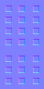| |  | | | 
Name: **support2.png** | | | | | |
Also known as: | | | | | |
| | | |  | | | 
Name: **sw11_1.png** | | | | | |
Also known as: | | | | | |
| | | |  | | | 
Name: **sw11_2.png** | | | | | |
Also known as: | | | | | |
| | | |  | | | 
Name: **sw11_4.png** | | | | | |
Also known as: | | | | | |
| | | |  | | | 
Name: **sw11_5.png** | | | | | |
Also known as: | | | | | |
| | | |  | | | 
Name: **sw12_1.png** | | | | | |
Also known as: | | | | | |
| | | |  | | | 
Name: **sw12_2.png** | | | | | |
Also known as: | | | | | |
| | | |  | | | 
Name: **sw12_4.png** | | | | | |
Also known as: | | | | | |
| | | |  | | | 
Name: **sw12_5.png** | | | | | |
Also known as: | | | | | |
| | | |  | | | 
Name: **sw15_1.png** | | | | | |
Also known as: | | | | | |
| | | |  | | | 
Name: **sw15_3.png** | | | | | |
Also known as: | | | | | |
| | | |  | | | 
Name: **sw15_4.png** | | | | | |
Also known as: | | | | | |
| | | |  | | | 
Name: **sw15_6.png** | | | | | |
Also known as: | | | | | |
| | | |  | | | 
Name: **sw16_1.png** | | | | | |
Also known as: | | | | | |
| | | |  | | | 
Name: **sw16_2.png** | | | | | |
Also known as: | | | | | |
| | | |  | | | 
Name: **sw16_4.png** | | | | | |
Also known as: | | | | | |
| | | |  | | | 
Name: **sw16_6.png** | | | | | |
Also known as: | | | | | |
| | | |  | | | 
Name: **sw17_1.png** | | | | | |
Also known as: | | | | | |
| | | |  | | | 
Name: **sw17_2.png** | | | | | |
Also known as: | | | | | |
| | | |  | | | 
Name: **sw17_3.png** | | | | | |
Also known as: | | | | | |
| | | |  | | | 
Name: **sw17_4.png** | | | | | |
Also known as: | | | | | |
| | | |  | | | 
Name: **sw17_5.png** | | | | | |
Also known as: | | | | | |
| | | |  | | | 
Name: **sw17_6.png** | | | | | |
Also known as: | | | | | |
| | | |  | | | 
Name: **sw18_5.png** | | | | | |
Also known as: | | | | | |
| | | |  | | | 
Name: **sw18_7.png** | | | | | |
Also known as: | | | | | |
| | | |  | | | 
Name: **sw19_1.png** | | | | | |
Also known as: | | | | | |
| | | |  | | | 
Name: **sw19_2.png** | | | | | |
Also known as: | | | | | |
| | | |  | | | 
Name: **sw19_3.png** | | | | | |
Also known as: | | | | | |
| | | |  | | | 
Name: **sw19_4.png** | | | | | |
Also known as: | | | | | |
| | | |  | | | 
Name: **sw1s0.png** | | | | | |
Also known as: | | | | | |
| | | |  | | | 
Name: **sw1s1.png** | | | | | |
Also known as: | | | | | |
| | | |  | | | 
Name: **sw1skull.png** | | | | | |
Also known as: | | | | | |
| | | |  | | | 
Name: **sw2_1.png** | | | | | |
Also known as: | | | | | |
| | | |  | | | 
Name: **sw2_2.png** | | | | | |
Also known as: | | | | | |
| | | |  | | | 
Name: **sw2_3.png** | | | | | |
Also known as: | | | | | |
| | | |  | | | 
Name: **sw2_4.png** | | | | | |
Also known as: | | | | | |
| | | |  | | | 
Name: **sw2_5.png** | | | | | |
Also known as: | | | | | |
| | | |  | | | 
Name: **sw2_6.png** | | | | | |
Also known as: | | | | | |
| | | |  | | | 
Name: **sw2_7.png** | | | | | |
Also known as: | | | | | |
| | | |  | | | 
Name: **sw2_8.png** | | | | | |
Also known as: | | | | | |
| | | |  | | | 
Name: **sw2s0.png** | | | | | |
Also known as: | | | | | |
| | | |  | | | 
Name: **sw2s1.png** | | | | | |
Also known as: | | | | | |
| | | |  | | | 
Name: **sw2skull.png** | | | | | |
Also known as: | | | | | |
| | | |  | | | 
Name: **sw3s0.png** | | | | | |
Also known as: | | | | | |
| | | |  | | | 
Name: **sw3s1.png** | | | | | |
Also known as: | | | | | |
| | | |  | | | 
Name: **sw4s0.png** | | | | | |
Also known as: | | | | | |
| | | |  | | | 
Name: **sw4s1.png** | | | | | |
Also known as: | | | | | |
| | | |  | | | 
Name: **t14_3.png** | | | | | |
Also known as: | | | | | |
| | | |  | | | 
Name: **t14_5.png** | | | | | |
Also known as: | | | | | |
| | | |  | | | 
Name: **tile.png** | | | | | |
Also known as: | | | | | |
| | | |  | | | 
Name: **tomw2_1.png** | | | | | |
Also known as: | | | | | |
| | | |  | | | 
Name: **tomw2_2.png** | | | | | |
Also known as: | | | | | |
| | | |  | | | 
Name: **tp2_1.png** | | | | | |
Also known as: | | | | | |
| | | |  | | | 
Name: **tp2_2.png** | | | | | |
Also known as: | | | | | |
| | | |  | | | 
Name: **tp3_1.png** | | | | | |
Also known as: | | | | | |
| | | |  | | | 
Name: **tp3_2.png** | | | | | |
Also known as: | | | | | |
| | | |  | | | 
Name: **tp5_1.png** | | | | | |
Also known as: | | | | | |
| | | |  | | | 
Name: **tp5_2.png** | | | | | |
Also known as: | | | | | |
| | | |  | | | 
Name: **tp5_3.png** | | | | | |
Also known as: | | | | | |
| | | |  | | | 
Name: **tp5_4.png** | | | | | |
Also known as: | | | | | |
| | | |  | | | 
Name: **tp7_1.png** | | | | | |
Also known as: | | | | | |
| | | |  | | | 
Name: **tp7_2.png** | | | | | |
Also known as: | | | | | |
| | | |  | | | 
Name: **tscrn2.png** | | | | | |
Also known as: | | | | | |
| | | |  | | | 
Name: **tscrn3.png** | | | | | |
Also known as: | | | | | |
| | | |  | | | 
Name: **tscrn4.png** | | | | | |
Also known as: | | | | | |
| | | |  | | | 
Name: **tscrn5.png** | | | | | |
Also known as: | | | | | |
| | | |  | | | 
Name: **tscrn6.png** | | | | | |
Also known as: | | | | | |
| | | |  | | | 
Name: **tscrn8.png** | | | | | |
Also known as: | | | | | |
| | | |  | | | 
Name: **ttall1_2.png** | | | | | |
Also known as: | | | | | |
| | | |  | | | 
Name: **tyunder1.png** | | | | | |
Also known as: | | | | | |
| | | |  | | | 
Name: **tywfall1.png** | | | | | |
Also known as: | | | | | |
| | | |  | | | 
Name: **tywfall2.png** | | | | | |
Also known as: | | | | | |
| | | |  | | | 
Name: **tywfall3.png** | | | | | |
Also known as: | | | | | |
| | | |  | | | 
Name: **tywfall4.png** | | | | | |
Also known as: | | | | | |
| | | |  | | | 
Name: **tywheel1.png** | | | | | |
Also known as: | | | | | |
| | | |  | | | 
Name: **vgcrate1.png** | | | | | |
Also known as: | | | | | |
| | | |  | | | 
Name: **vines1.png** | | | | | |
Also known as: | | | | | |
| | | |  | | | 
Name: **w101_1.png** | | | | | |
Also known as: | | | | | |
| | | |  | | | 
Name: **w101_2.png** | | | | | |
Also known as: | | | | | |
| | | |  | | | 
Name: **w102_1.png** | | | | | |
Also known as: | | | | | |
| | | |  | | | 
Name: **w102_2.png** | | | | | |
Also known as: | | | | | |
| | | |  | | | 
Name: **w103_1.png** | | | | | |
Also known as: | | | | | |
| | | |  | | | 
Name: **w103_2.png** | | | | | |
Also known as: | | | | | |
| | | |  | | | 
Name: **w104_1.png** | | | | | |
Also known as: | | | | | |
| | | |  | | | 
Name: **w105_1.png** | | | | | |
Also known as: | | | | | |
| | | |  | | | 
Name: **w106_1.png** | | | | | |
Also known as: | | | | | |
| | | |  | | | 
Name: **w107_1.png** | | | | | |
Also known as: | | | | | |
| | | |  | | | 
Name: **w108_1.png** | | | | | |
Also known as: | | | | | |
| | | |  | | | 
Name: **w108_2.png** | | | | | |
Also known as: | | | | | |
| | | |  | | | 
Name: **w108_3.png** | | | | | |
Also known as: | | | | | |
| | | |  | | | 
Name: **w108_4.png** | | | | | |
Also known as: | | | | | |
| | | |  | | | 
Name: **w109_1.png** | | | | | |
Also known as: | | | | | |
| | | |  | | | 
Name: **w109_2.png** | | | | | |
Also known as: | | | | | |
| | | |  | | | 
Name: **w110_1.png** | | | | | |
Also known as: | | | | | |
| | | |  | | | 
Name: **w111_2.png** | | | | | |
Also known as: | | | | | |
| | | |  | | | 
Name: **w111_3.png** | | | | | |
Also known as: | | | | | |
| | | |  | | | 
Name: **w112_1.png** | | | | | |
Also known as: | | | | | |
| | | |  | | | 
Name: **w112_2.png** | | | | | |
Also known as: | | | | | |
| | | |  | | | 
Name: **w112_3.png** | | | | | |
Also known as: | | | | | |
| | | |  | | | 
Name: **w113_1.png** | | | | | |
Also known as: | | | | | |
| | | |  | | | 
Name: **w113_2.png** | | | | | |
Also known as: | | | | | |
| | | |  | | | 
Name: **w113_3.png** | | | | | |
Also known as: | | | | | |
| | | |  | | | 
Name: **w13_1.png** | | | | | |
Also known as: | | | | | |
| | | |  | | | 
Name: **w13_8.png** | | | | | |
Also known as: | | | | | |
| | | |  | | | 
Name: **w13_a.png** | | | | | |
Also known as: | | | | | |
| | | |  | | | 
Name: **w15_4.png** | | | | | |
Also known as: | | | | | |
| | | |  | | | 
Name: **w15_5.png** | | | | | |
Also known as: | | | | | |
| | | |  | | | 
Name: **w15_6.png** | | | | | |
Also known as: | | | | | |
| | | |  | | | 
Name: **w17_1.png** | | | | | |
Also known as: | | | | | |
| | | |  | | | 
Name: **w28_5.png** | | | | | |
Also known as: | | | | | |
| | | |  | | | 
Name: **w28_6.png** | | | | | |
Also known as: | | | | | |
| | | |  | | | 
Name: **w28_7.png** | | | | | |
Also known as: | | | | | |
| | | |  | | | 
Name: **w28_8.png** | | | | | |
Also known as: | | | | | |
| | | |  | | | 
Name: **w31_1.png** | | | | | |
Also known as: | | | | | |
| | | |  | | | 
Name: **w32_1.png** | | | | | |
Also known as: | | | | | |
| | | |  | | | 
Name: **w32_4.png** | | | | | |
Also known as: | | | | | |
| | | |  | | | 
Name: **w33_5.png** | | | | | |
Also known as: | | | | | |
| | | |  | | | 
Name: **w33_7.png** | | | | | |
Also known as: | | | | | |
| | | |  | | | 
Name: **w33_8.png** | | | | | |
Also known as: | | | | | |
| | | |  | | | 
Name: **w46_37.png** | | | | | |
Also known as: | | | | | |
| | | |  | | | 
Name: **w46_38.png** | | | | | |
Also known as: | | | | | |
| | | |  | | | 
Name: **w46_39.png** | | | | | |
Also known as: | | | | | |
| | | |  | | | 
Name: **w64b_1.png** | | | | | |
Also known as: | | | | | |
| | | |  | | | 
Name: **w64b_2.png** | | | | | |
Also known as: | | | | | |
| | | |  | | | 
Name: **w65b_1.png** | | | | | |
Also known as: | | | | | |
| | | |  | | | 
Name: **w65b_2.png** | | | | | |
Also known as: | | | | | |
| | | |  | | | 
Name: **w67_1.png** | | | | | |
Also known as: | | | | | |
| | | |  | | | 
Name: **w67_2.png** | | | | | |
Also known as: | | | | | |
| | | |  | | | 
Name: **w73a_1.png** | | | | | |
Also known as: | | | | | |
| | | |  | | | 
Name: **w73a_2.png** | | | | | |
Also known as: | | | | | |
| | | |  | | | 
Name: **w73b_1.png** | | | | | |
Also known as: | | | | | |
| | | |  | | | 
Name: **w74a_1.png** | | | | | |
Also known as: | | | | | |
| | | |  | | | 
Name: **w74a_2.png** | | | | | |
Also known as: | | | | | |
| | | |  | | | 
Name: **w74b_1.png** | | | | | |
Also known as: | | | | | |
| | | |  | | | 
Name: **w92_1.png** | | | | | |
Also known as: | | | | | |
| | | |  | | | 
Name: **w92_2.png** | | | | | |
Also known as: | | | | | |
| | | |  | | | 
Name: **w94_1.png** | | | | | |
Also known as: | | | | | |
| | | |  | | | 
Name: **w96_1.png** | | | | | |
Also known as: | | | | | |
| | | |  | | | 
Name: **w96_2.png** | | | | | |
Also known as: | | | | | |
| | | |  | | | 
Name: **w98_1.png** | | | | | |
Also known as: | | | | | |
| | | |  | | | 
Name: **w98_2.png** | | | | | |
Also known as: | | | | | |
| | | |  | | | 
Name: **w99_1.png** | | | | | |
Also known as: | | | | | |
| | | |  | | | 
Name: **w99_2.png** | | | | | |
Also known as: | | | | | |
| | | |  | | | 
Name: **wall00_1.png** | | | | | |
Also known as: | | | | | |
| | | |  | | | 
Name: **wall00_2.png** | | | | | |
Also known as: | | | | | |
| | | |  | | | 
Name: **wall00_3.png** | | | | | |
Also known as: | | | | | |
| | | |  | | | 
Name: **wall00_5.png** | | | | | |
Also known as: | | | | | |
| | | |  | | | 
Name: **wall00_6.png** | | | | | |
Also known as: | | | | | |
| | | |  | | | 
Name: **wall00_7.png** | | | | | |
Also known as: | | | | | |
| | | |  | | | 
Name: **wall00_8.png** | | | | | |
Also known as: | | | | | |
| | | |  | | | 
Name: **wall01_1.png** | | | | | |
Also known as: | | | | | |
| | | |  | | | 
Name: **wall01_2.png** | | | | | |
Also known as: | | | | | |
| | | |  | | | 
Name: **wall01_3.png** | | | | | |
Also known as: | | | | | |
| | | |  | | | 
Name: **wall01_4.png** | | | | | |
Also known as: | | | | | |
| | | |  | | | 
Name: **wall01_5.png** | | | | | |
Also known as: | | | | | |
| | | |  | | | 
Name: **wall01_6.png** | | | | | |
Also known as: | | | | | |
| | | |  | | | 
Name: **wall01_7.png** | | | | | |
Also known as: | | | | | |
| | | |  | | | 
Name: **wall01_8.png** | | | | | |
Also known as: | | | | | |
| | | |  | | | 
Name: **wall01_9.png** | | | | | |
Also known as: | | | | | |
| | | |  | | | 
Name: **wall01_a.png** | | | | | |
Also known as: | | | | | |
| | | |  | | | 
Name: **wall01_b.png** | | | | | |
Also known as: | | | | | |
| | | |  | | | 
Name: **wall01_c.png** | | | | | |
Also known as: | | | | | |
| | | |  | | | 
Name: **wall02_1.png** | | | | | |
Also known as: | | | | | |
| | | |  | | | 
Name: **wall02_2.png** | | | | | |
Also known as: | | | | | |
| | | |  | | | 
Name: **wall02_3.png** | | | | | |
Also known as: | | | | | |
| | | |  | | | 
Name: **wall03_1.png** | | | | | |
Also known as: | | | | | |
| | | |  | | | 
Name: **wall03_3.png** | | | | | |
Also known as: | | | | | |
| | | |  | | | 
Name: **wall03_4.png** | | | | | |
Also known as: | | | | | |
| | | |  | | | 
Name: **wall03_7.png** | | | | | |
Also known as: | | | | | |
| | | |  | | | 
Name: **wall04_2.png** | | | | | |
Also known as: | | | | | |
| | | |  | | | 
Name: **wall04_3.png** | | | | | |
Also known as: | | | | | |
| | | |  | | | 
Name: **wall04_4.png** | | | | | |
Also known as: | | | | | |
| | | |  | | | 
Name: **wall04_5.png** | | | | | |
Also known as: | | | | | |
| | | |  | | | 
Name: **wall04_7.png** | | | | | |
Also known as: | | | | | |
| | | |  | | | 
Name: **wall04_9.png** | | | | | |
Also known as: | | | | | |
| | | |  | | | 
Name: **wall04_a.png** | | | | | |
Also known as: | | | | | |
| | | |  | | | 
Name: **wall04_b.png** | | | | | |
Also known as: | | | | | |
| | | |  | | | 
Name: **wall04_c.png** | | | | | |
Also known as: | | | | | |
| | | |  | | | 
Name: **wall05_2.png** | | | | | |
Also known as: | | | | | |
| | | |  | | | 
Name: **wall21_1.png** | | | | | |
Also known as: | | | | | |
| | | |  | | | 
Name: **wall21_3.png** | | | | | |
Also known as: | | | | | |
| | | |  | | | 
Name: **wall21_5.png** | | | | | |
Also known as: | | | | | |
| | | |  | | | 
Name: **wall22_1.png** | | | | | |
Also known as: | | | | | |
| | | |  | | | 
Name: **wall23_1.png** | | | | | |
Also known as: | | | | | |
| | | |  | | | 
Name: **wall23_2.png** | | | | | |
Also known as: | | | | | |
| | | |  | | | 
Name: **wall24_1.png** | | | | | |
Also known as: | | | | | |
| | | |  | | | 
Name: **wall25_1.png** | | | | | |
Also known as: | | | | | |
| | | |  | | | 
Name: **wall30_2.png** | | | | | |
Also known as: | | | | | |
| | | |  | | | 
Name: **wall30_3.png** | | | | | |
Also known as: | | | | | |
| | | |  | | | 
Name: **wall30_4.png** | | | | | |
Also known as: | | | | | |
| | | |  | | | 
Name: **wall40_1.png** | | | | | |
Also known as: | | | | | |
| | | |  | | | 
Name: **wall40_2.png** | | | | | |
Also known as: | | | | | |
| | | |  | | | 
Name: **wall42_1.png** | | | | | |
Also known as: | | | | | |
| | | |  | | | 
Name: **wall42_3.png** | | | | | |
Also known as: | | | | | |
| | | |  | | | 
Name: **wall42_5.png** | | | | | |
Also known as: | | | | | |
| | | |  | | | 
Name: **wall42_6.png** | | | | | |
Also known as: | | | | | |
| | | |  | | | 
Name: **wall47_1.png** | | | | | |
Also known as: | | | | | |
| | | |  | | | 
Name: **wall47_2.png** | | | | | |
Also known as: | | | | | |
| | | |  | | | 
Name: **wall47_3.png** | | | | | |
Also known as: | | | | | |
| | | |  | | | 
Name: **wall47_4.png** | | | | | |
Also known as: | | | | | |
| | | |  | | | 
Name: **wall47_5.png** | | | | | |
Also known as: | | | | | |
| | | |  | | | 
Name: **wall48_1.png** | | | | | |
Also known as: | | | | | |
| | | |  | | | 
Name: **wall48_2.png** | | | | | |
Also known as: | | | | | |
| | | |  | | | 
Name: **wall48_3.png** | | | | | |
Also known as: | | | | | |
| | | |  | | | 
Name: **wall48_4.png** | | | | | |
Also known as: | | | | | |
| | | |  | | | 
Name: **wall49_1.png** | | | | | |
Also known as: | | | | | |
| | | |  | | | 
Name: **wall49_2.png** | | | | | |
Also known as: | | | | | |
| | | |  | | | 
Name: **wall49_3.png** | | | | | |
Also known as: | | | | | |
| | | |  | | | 
Name: **wall49_4.png** | | | | | |
Also known as: | | | | | |
| | | |  | | | 
Name: **wall50_1.png** | | | | | |
Also known as: | | | | | |
| | | |  | | | 
Name: **wall50_2.png** | | | | | |
Also known as: | | | | | |
| | | |  | | | 
Name: **wall51_1.png** | | | | | |
Also known as: | | | | | |
| | | |  | | | 
Name: **wall51_2.png** | | | | | |
Also known as: | | | | | |
| | | |  | | | 
Name: **wall51_3.png** | | | | | |
Also known as: | | | | | |
| | | |  | | | 
Name: **wall52_1.png** | | | | | |
Also known as: | | | | | |
| | | |  | | | 
Name: **wall52_2.png** | | | | | |
Also known as: | | | | | |
| | | |  | | | 
Name: **wall53_1.png** | | | | | |
Also known as: | | | | | |
| | | |  | | | 
Name: **wall54_1.png** | | | | | |
Also known as: | | | | | |
| | | |  | | | 
Name: **wall54_2.png** | | | | | |
Also known as: | | | | | |
| | | |  | | | 
Name: **wall55_1.png** | | | | | |
Also known as: | | | | | |
| | | |  | | | 
Name: **wall57_1.png** | | | | | |
Also known as: | | | | | |
| | | |  | | | 
Name: **wall57_2.png** | | | | | |
Also known as: | | | | | |
| | | |  | | | 
Name: **wall57_3.png** | | | | | |
Also known as: | | | | | |
| | | |  | | | 
Name: **wall57_4.png** | | | | | |
Also known as: | | | | | |
| | | |  | | | 
Name: **wall58_1.png** | | | | | |
Also known as: | | | | | |
| | | |  | | | 
Name: **wall58_2.png** | | | | | |
Also known as: | | | | | |
| | | |  | | | 
Name: **wall58_3.png** | | | | | |
Also known as: | | | | | |
| | | |  | | | 
Name: **wall59_1.png** | | | | | |
Also known as: | | | | | |
| | | |  | | | 
Name: **wall59_2.png** | | | | | |
Also known as: | | | | | |
| | | |  | | | 
Name: **wall59_3.png** | | | | | |
Also known as: | | | | | |
| | | |  | | | 
Name: **wall59_4.png** | | | | | |
Also known as: | | | | | |
| | | |  | | | 
Name: **wall62_1.png** | | | | | |
Also known as: | | | | | |
| | | |  | | | 
Name: **wall62_2.png** | | | | | |
Also known as: | | | | | |
| | | |  | | | 
Name: **wall63_1.png** | | | | | |
Also known as: | | | | | |
| | | |  | | | 
Name: **wall63_2.png** | | | | | |
Also known as: | | | | | |
| | | |  | | | 
Name: **wall64_2.png** | | | | | |
Also known as: | | | | | |
| | | |  | | | 
Name: **wall69_4.png** | | | | | |
Also known as: | | | | | |
| | | |  | | | 
Name: **wall69_9.png** | | | | | |
Also known as: | | | | | |
| | | |  | | | 
Name: **wall70_2.png** | | | | | |
Also known as: | | | | | |
| | | |  | | | 
Name: **wall70_3.png** | | | | | |
Also known as: | | | | | |
| | | |  | | | 
Name: **wall70_4.png** | | | | | |
Also known as: | | | | | |
| | | |  | | | 
Name: **wall70_9.png** | | | | | |
Also known as: | | | | | |
| | | |  | | | 
Name: **wall71_5.png** | | | | | |
Also known as: | | | | | |
| | | |  | | | 
Name: **wall72_3.png** | | | | | |
Also known as: | | | | | |
| | | |  | | | 
Name: **wall72_5.png** | | | | | |
Also known as: | | | | | |
| | | |  | | | 
Name: **wall72_7.png** | | | | | |
Also known as: | | | | | |
| | | |  | | | 
Name: **wall76_1.png** | | | | | |
Also known as: | | | | | |
| | | |  | | | 
Name: **wall78_1.png** | | | | | |
Also known as: | | | | | |
| | | |  | | | 
Name: **wall79_1.png** | | | | | |
Also known as: | | | | | |
| | | |  | | | 
Name: **wall97_1.png** | | | | | |
Also known as: | | | | | |
| | | |  | | | 
Name: **wall97_2.png** | | | | | |
Also known as: | | | | | |
| | | |  | | | 
Name: **wall97_3.png** | | | | | |
Also known as: | | | | | |
| | | |  | | | 
Name: **warna0.png** | | | | | |
Also known as: | | | | | |
| | | |  | | | 
Name: **warnb0.png** | | | | | |
Also known as: | | | | | |
| | | |  | | | 
Name: **wla128_1.png** | | | | | |
Also known as: | | | | | |
| | | |  | | | 
Name: **wlita0.png** | | | | | |
Also known as: | | | | | |
| | | |  | | | 
Name: **wlitb0.png** | | | | | |
Also known as: | | | | | |
| | | |  | | | 
Name: **wlitc0.png** | | | | | |
Also known as: | | | | | |
| | | |  | | | 
Name: **wolf1.png** | | | | | |
Also known as: | | | | | |
| | | |  | | | 
Name: **wolf10.png** | | | | | |
Also known as: | | | | | |
| | | |  | | | 
Name: **wolf11.png** | | | | | |
Also known as: | | | | | |
| | | |  | | | 
Name: **wolf12.png** | | | | | |
Also known as: | | | | | |
| | | |  | | | 
Name: **wolf13.png** | | | | | |
Also known as: | | | | | |
| | | |  | | | 
Name: **wolf14.png** | | | | | |
Also known as: | | | | | |
| | | |  | | | 
Name: **wolf17.png** | | | | | |
Also known as: | | | | | |
| | | |  | | | 
Name: **wolf18.png** | | | | | |
Also known as: | | | | | |
| | | |  | | | 
Name: **wolf2.png** | | | | | |
Also known as: | | | | | |
| | | |  | | | 
Name: **wolf3.png** | | | | | |
Also known as: | | | | | |
| | | |  | | | 
Name: **wolf4.png** | | | | | |
Also known as: | | | | | |
| | | |  | | | 
Name: **wolf5.png** | | | | | |
Also known as: | | | | | |
| | | |  | | | 
Name: **wolf6.png** | | | | | |
Also known as: | | | | | |
| | | |  | | | 
Name: **wolf7.png** | | | | | |
Also known as: | | | | | |
| | | |  | | | 
Name: **wolf9.png** | | | | | |
Also known as: | | | | | |
| | | |  | | | 
Name: **wood.png** | | | | | |
Also known as: | | | | | |
| | | |  | | | 
Name: **yellite1.png** | | | | | |
Also known as: | | | | | |
| | | |  | | | 
Name: **yellite2.png** | | | | | |
Also known as: | | | | | |
| | | |  | | | 
Name: **yellite3.png** | | | | | |
Also known as: | | | | | |
| | | |  | | | 
Name: **yellow.png** | | | | | |
Also known as: | | | | | |
| | | |  | | | 
Name: **yeltnt.png** | | | | | |
Also known as: | | | | | |
